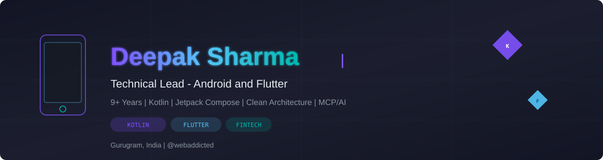

<picture>
  <source media="(prefers-color-scheme: dark)" srcset="deepak-banner.svg">
  <source media="(prefers-color-scheme: light)" srcset="deepak-banner-light.svg">
  
</picture>

 

<table>
<tr>
<td width="300" valign="top">

</td>
<td valign="top">

<h3>My Featured Work</h3>

| Project | Tech | Stars |
|:---|:---:|:---:|
| [KotlinProject](https://github.com/webaddicted/KotlinProject) | `Kotlin` `Material` | 86 |
| [CleanArchitecture](https://github.com/webaddicted/CleanArchitecture) | `Kotlin` `MVVM` | 10 |
| [ImagePickerCompressor](https://github.com/webaddicted/ImagePickerCompressor) | `Kotlin` `Android` | 9 |
| [PaymentGetway](https://github.com/webaddicted/PaymentGetway) | `Flutter` `Dart` | 3 |
| [Paytm for Business](https://play.google.com/store/apps/details?id=com.paytm.business) | `Kotlin` `Jetpack` | 50M+ |
| [Movies4U](https://play.google.com/store/apps/details?id=com.webaddicted.movies4u) | `Flutter` `Dart` | Play Store |

> *"I make UI beautiful. I love backend even more."*

</td>
</tr>
</table>

 

### About Me

- Technical Lead at **Paytm** — scaling [Paytm for Business](https://play.google.com/store/apps/details?id=com.paytm.business) to **50M+ users** and **10M+ merchants**
- **9+ years** delivering Android and Flutter products across **Fintech, Telecom, Travel, and Banking**
- Expert in **Kotlin, Jetpack Compose, Flutter, Clean Architecture**, and **MCP/AI workflow automation**
- Reduced APK size by **~25%** and cold start by **~30%** at Paytm P4B scale
- Previously at **Deloitte**, **Infogain**, **TechAhead**, and **TechieSolve**

### Career Highlights

| Company | Role | Period |
|:---|:---|:---:|
| Paytm | Technical Lead — Android & Flutter | 2022 – Present |
| Deloitte India | Senior Android Developer | 2021 – 2022 |
| Infogain | Android & Flutter Developer | 2019 – 2021 |
| TechAhead | Software Engineer — Android | 2018 – 2019 |

 

### GitHub Stats & Graphs

  

  

  

  

 

### Watch the snake eat my contributions

<picture>
  <source media="(prefers-color-scheme: dark)" srcset="https://raw.githubusercontent.com/webaddicted/webaddicted/output/github-snake-mobile.svg">
  <source media="(prefers-color-scheme: light)" srcset="https://raw.githubusercontent.com/webaddicted/webaddicted/output/github-snake.svg">
  
</picture>

 

### Tech Stack

  

 

### Let's Connect

 

  

*Always learning, always building — one commit at a time.*

